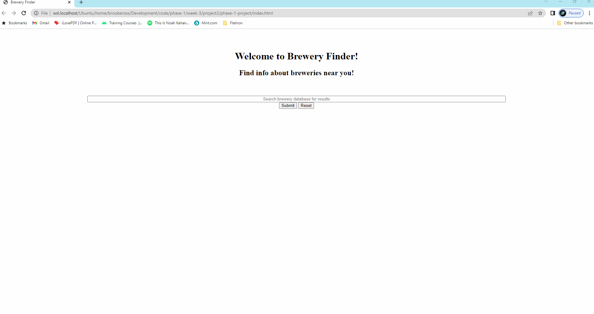
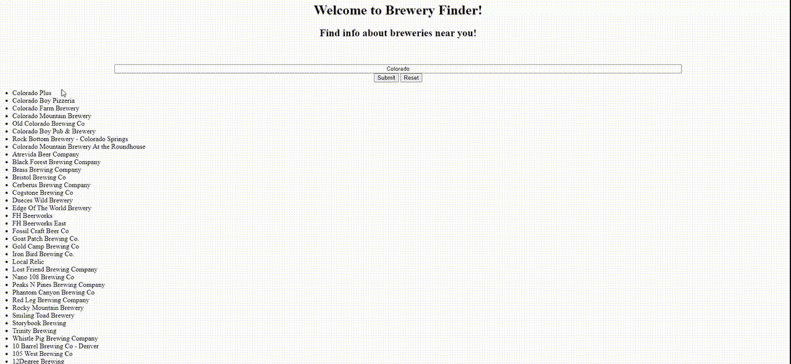

# Brewery Finder Web Application

Welcome to our Brewery finders web page! Created in the Flatiron's Phase 1 Project Week by Bo Brockmann and Brooke Ross. Below you will find the purpose and functionality of our web page and how to use it!

## Instructions
1. Open the application in your web browser. You will see the following page:

2. From this page a user will be able to access a wide database of information about breweries within the United States! 
3. You can search breweries by typing in a location (state/city) or the name of the brewery you are looking for.
    Note: the search engine will also take in key words and can bring up breweries whose names match (might not stay in the same location though!)
4. Once you have typed in your search queary you can press enter to search, or click the search button. 
5. From here you can click on any of the breweries on the left, to pull their information up. Information that is available includes the breweries: name, location (city/state), phone number, and website URL.
6. Once you have found a brewery that interests you, you can click the favorite button below it's information and add it to a favorites list.
7. Below is a gif that models the websites functions for you! Enjoy!

